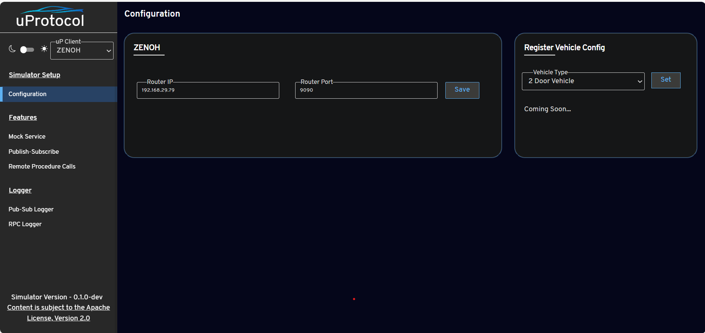
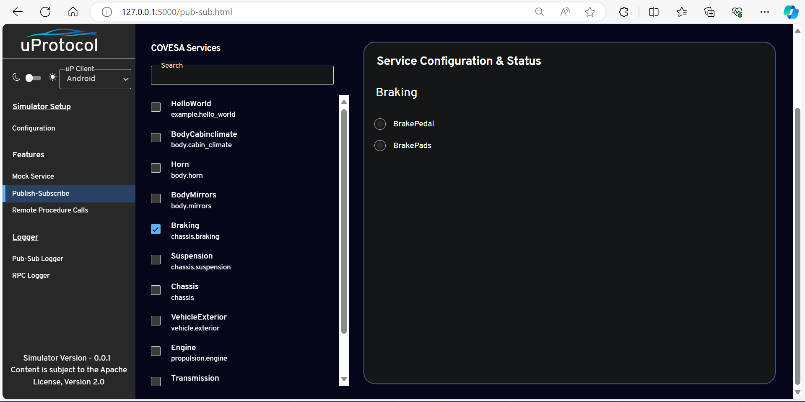

= Eclipse up-Simulator
:toc:

== Overview

The `up-simulator` is a web-based tool that facilitates the testing of publish/subscribe (pub/sub) and Remote Procedure Call (RPC) transactions. It is designed to support the testing of various `up-client` libraries such as `up-client-zenoh`, `up-client-someip`, `up-client-android`, etc. Please note that the development is currently in progress.

== Features

The `up-simulator` provides mock services that simulate real vehicle services on a PC, replicating the interface and behavior of actual vehicle services. It captures all pub/sub and RPC transactions occurring between mock services and apps under development.

== How to Setup the Simulator

To set up the simulator, follow the steps below:

. Clone the code from the GitHub repository:
+
[source]
----
$ git clone https://github.com/eclipse-uprotocol/up-simulator.git
$ cd up-simulator
----

. Install the required dependencies using pip:
+
[source]
----
$ pip install -r requirements.txt
----

. Execute the `setup_simulator.py` script using the following command:
+
[source]
----
$ python setup_simulator.py
----

This script performs the following tasks:

* Clones the `covesa` protos, compiles it, and generates Python protofiles in the target folder.

* Iterates through all protofiles and generates a resource catalog in the target folder.

* Iterates through the protos again and generates a `services.json` file. This file is responsible for the UI of the simulator. At runtime, it parses the JSON to get a list of services, RPC, and messages and displays them in the UI.

Running this script will generate all the mandatory files needed by the simulator to function.

== How to Start and Use the uP Simulator

To start and use the `up-simulator`, follow the steps below:

. Execute the following command to start the simulator:
+
[source]
----
$ cd simulator
$ python run.py
----

. On the uP Simulator web interface, you will see a dropdown to select the uP client. Currently, it supports only Zenoh. Choose "Zenoh" from the dropdown.
+
image::screenshots/configuration.png[]

. Go to the configuration page and provide your Zenoh router's IP address and port in the respective fields on the configuration page.

- **Zenoh Router IP:** [Your Zenoh Router IP]
- **Zenoh Router Port:** [Your Zenoh Router Port]
+

. Click on the "Save" button to save the Zenoh router configuration.
+
[NOTE]
Ensure that you have started the Zenoh router using the `zenohd` command before configuring the uP Simulator.

. To use the publish and subscribe functionality, click on the "Publish-Subscribe" menu. Within this menu, you will find a list of Covesa services.
+

. Choose the service you want to test for either subscribing or publishing. You can scroll through the list or use the search box to find your service. Once you've selected the service, the simulator will display a list of all supported messages.

+

. Choose the specific message for which you want to test both subscribing or publishing
+
image::screenshots/pub-sub-resource.png[]

. Click on the "Subscribe" button to listen for the message data.
+
image::screenshots/subscribe.png[]

. Select the values you want to publish.

. Click on the "Publish" button to send the selected values.
+
image::screenshots/publish.png[]

. To test RPC, go to the mock service page, and start the mock service you wish to use for triggering the RPC request.
+
image::screenshots/covesa-services.png[]
image::screenshots/start-service.png[]

. To initiate an RPC request, navigate to the "Remote Procedure Calls" menu. Within this menu, you'll find a list of Covesa services. Select the particular service you wish to test. Once the service is chosen, a list of available RPCs for that specific service will be displayed. From this list, choose the specific RPC you intend to test.

+
image::screenshots/hello_world_service.png[]

. Provide your input and click on the "Send RPC" button.
+
image::screenshots/rpc-test.png[]

. You can now see the RPC request and response logs in the logs window.

== Additional Notes

- The script assumes that Python is installed on your system.
- The `requirements.txt` file contains a list of dependencies that will be installed using pip.
- The simulator is designed to be independent of the specific up client configuration during the setup phase.

Feel free to explore and contribute to the development of the `up-simulator`!

[NOTE]
This project is currently under development, and further enhancements and features are expected in future.

