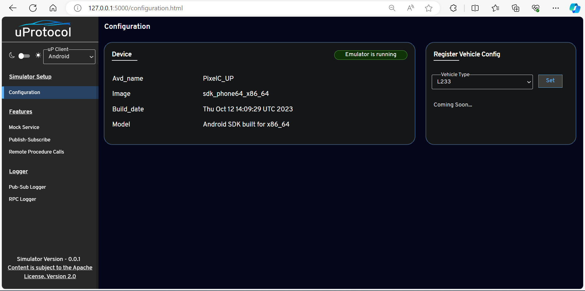
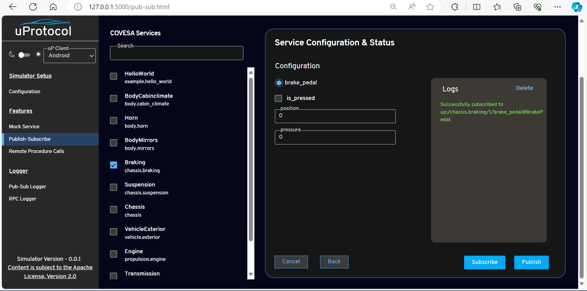
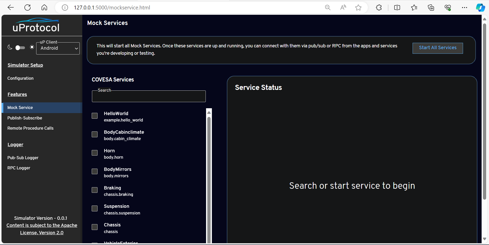
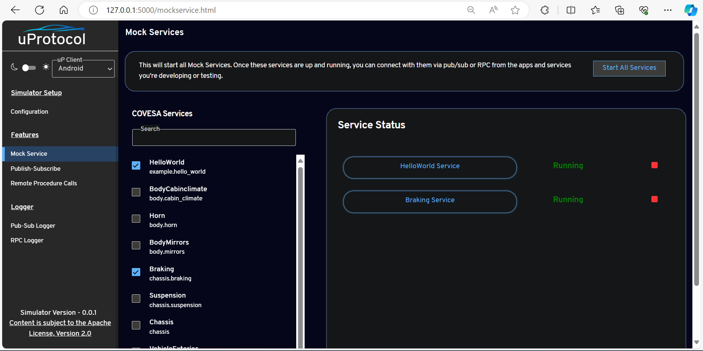
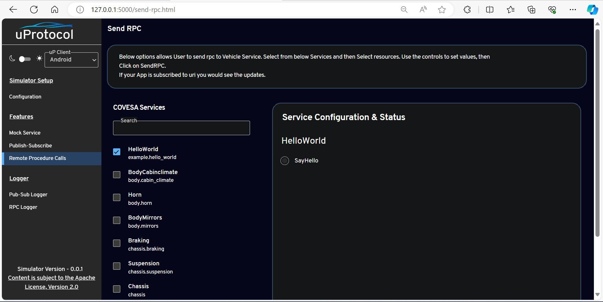

= Eclipse up-Simulator
:toc:

== Overview

The `up-simulator` is a user-friendly web tool designed to make developing uProtocol services and Apps on PCs easy. Its intuitive interface empowers users with features such as Publish-Subscribe, RPC invocation, and the simulation of COVESA Vehicle Services. With a focus on a user-friendly graphical interface (GUI), users can easily navigate through the development and testing phases of uProtocol Apps, ensuring a smooth experience from start to finish.

== Architecture Overview

.  **up-Simulator **:
+
.Description:

The up-Simulator operates as a web-based tool on PCs, establishing connections with any uPlatform supporting up-client (e.g., up-client-zenoh, up-client-someip, up-client-android).

+
.Features:

Simulates COVESA services (COVESA mock Service): These services replicate real vehicle services on the PC, emulating the interface and behavior of actual services.

.  **Mock Services **:
+
.Description:
COVESA mock services mirror real COVESA vehicle services on the PC, replicating both interface and behavior.
+
.Features:

Eliminates the need for real services: Developers can perform testing without requiring real hardware, enhancing the development environment.
Ensures consistent testing: Simulated services mirror real-world scenarios, providing reliable testing conditions.

.  **Simulation Portal **:
+
.Description:
The simulation portal offers a web-based user interface for initiating pub/sub and RPC transactions using mock services.
+
.Features:

Allows developers to trigger and monitor transactions: Developers can efficiently manage transactions through an accessible and user-friendly interface.
Streamlines testing: The portal serves as a centralized control point, simplifying the testing of applications.

.  **uLogging (Dashboard) **:
+
.Description:
The uLogging component captures all pub/sub and RPC transactions between mock services and apps/services under development.
+
.Features:

Facilitates real-time monitoring and logging: Developers can monitor transactions in real-time, aiding in debugging and issue resolution.
Offers insights into communication between components: Provides valuable insights into the interactions between components, supporting the refinement of application behavior.

== How to Setup the Simulator

To set up the simulator, follow the steps below:

. Clone the code from the GitHub repository:
+
[source]
----
git clone https://github.com/eclipse-uprotocol/up-simulator.git
cd up-simulator
----

. Install the required dependencies using pip:
+
[source]
----
pip install -r requirements.txt
----

. Execute the `setup_simulator.py` script using the following command:
+
[source]
----
python setup_simulator.py
----

This script automates the following tasks:

1. **Cloning and Compilation of Protos:**
   Clones the `covesa` protos from the specified repository URL, compiles them, and generates Python protofiles in the target folder.

2. **Resource Catalog Generation:**
   Iterates through all protofiles to create a resource catalog in the target folder.

3. **Services Configuration File Generation:**
   Iterates through the protos again to generate a `services.json` file. This file is responsible for the UI of the simulator. At runtime, it parses the JSON to retrieve a list of services, RPC, and messages, and displays them in the UI.

Running this script will generate all the necessary files required for the simulator to function.

== How to Start and Use the uP Simulator

To start and use the `up-simulator`, follow the steps below:

. Execute the following command to start the simulator:
+
[source]
----
python run.py
----

. On the uP Simulator web interface, you will see a dropdown to select the uP client. Currently, it  supports only Android.
+

[NOTE]
To test pub,sub and rpc with up-android, ensure your emulator is up and the up-core service is running. Please refer to the installation instructions for up-core-service provided https://github.com/mishap4/up-android/blob/v1.5.0/up-core-android/README.adoc[here]..

. To use the publish and subscribe functionality, click on the "Publish-Subscribe" menu. Within this menu, you will find a list of Covesa services.
+
image::screenshots/pub-sub.png[]
. Choose the service you want to test for either subscribing or publishing. You can scroll through the list or use the search box to find your service. Once you've selected the service, the simulator will display a list of all supported messages.

+
image::screenshots/pub-sub-service.png[]

. Choose the specific message for which you want to test both subscribing or publishing
+
image::screenshots/pub-sub-resource.png[]

. Click on the "Subscribe" button to listen for the message data.
+

. Select the values you want to publish.

. Click on the "Publish" button to send the selected values.
+
image::screenshots/publish.png[]

. To test RPC, go to the mock service page, and start the mock service you wish to use for triggering the RPC request.
+

. To initiate an RPC request, navigate to the "Remote Procedure Calls" menu. Within this menu, you'll find a list of Covesa services. Select the particular service you wish to test. Once the service is chosen, a list of available RPCs for that specific service will be displayed. From this list, choose the specific RPC you intend to test.

+

. Provide your input and click on the "Send RPC" button.
+
image::screenshots/rpc-test.png[]

. You can now see the RPC request, response and publish, subscribe logs in the logger screen.
+

+

== Additional Notes

- The script assumes that Python is installed on your system.
- The `requirements.txt` file contains a list of dependencies that will be installed using pip.
- The simulator is designed to be independent of the specific up client configuration during the setup phase.

Feel free to explore and contribute to the development of the `up-simulator`!

[NOTE]
This project is currently under development, and further enhancements and features are expected in future.

